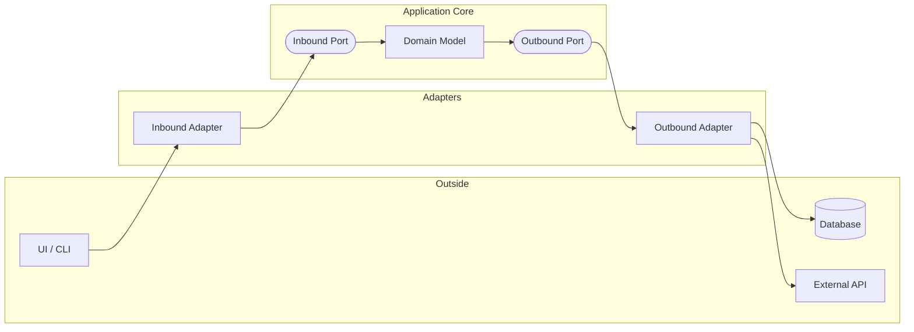

# Hexagonal Architecture (Ports and Adapters)

Hexagonal Architecture, also known as **Ports and Adapters**, was introduced by Alistair Cockburn. It focuses on creating a clear boundary between the application's core logic and the external systems it interacts with.

## Key Concept

The application's core is represented as a hexagon. The "inside" is the business logic, and the "outside" consists of external entities (databases, UIs, message brokers).



- **Core**: Contains the domain models and business rules.
- **Ports**: Interfaces that define how the application can be used (Driving Ports) or how the application uses external resources (Driven Ports).
- **Adapters**: Implementations of these ports that bridge the gap between the core and the outside world.

## Ideal Use Case

- Applications that need to be independent of their UI (can be run via CLI, Web, or API).
- Systems that need to switch between different database or messaging providers without changing business logic.
- Complex enterprise applications where testability is paramount.

## Benefits

- **Technology Independence**: The core is not tied to any specific database, framework, or UI.
- **Testability**: The core can be tested in isolation using mocks for ports.
- **Flexibility**: New adapters can be added or swapped with minimal impact on the core logic.

## Limitations

- **Complexity**: Introducing ports and adapters adds more layers and boilerplate code.
- **Overkill for Small Apps**: For simple CRUD applications, the abstraction might be unnecessary.
- **Performance**: While usually negligible, the additional layers of abstraction can introduce minor overhead.

## Folder Structure

```
noob.Architecture.Hexagonal/
├── Domain/               (Core business logic and entities)
├── Application/
│   ├── Ports/
│   │   ├── Inbound/      (Driving ports: e.g., IUserService)
│   │   └── Outbound/     (Driven ports: e.g., IUserRepository)
│   └── Services/         (Implementation of Inbound Ports)
└── Infrastructure/
    └── Adapters/
        ├── Inbound/      (Driving adapters: e.g., Controllers, CLI)
        └── Outbound/     (Driven adapters: e.g., Database, External APIs)
```
