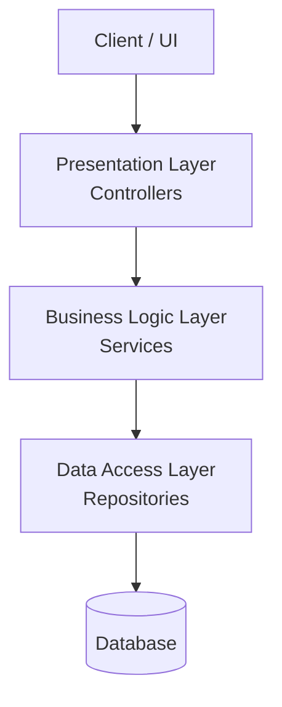

# N-Tier Architecture (3-Tier)

N-Tier Architecture is a traditional software architecture pattern where the application is divided into a number of logical layers. The most common form is the **3-Tier Architecture**.

## Key Concept

The application is structured into layers with specific responsibilities. Each layer typically only communicates with the layer immediately below it.



- **Presentation Layer (Controllers)**: Responsible for interacting with the user or external systems (Web API, CLI, UI). It handles input and returns output.
- **Business Logic Layer (Services)**: Contains the core business rules and logic. It coordinates tasks and processes data.
- **Data Access Layer (Repositories)**: Responsible for interacting with the data source (Database, File System). It handles CRUD operations.

## Ideal Use Case

- Simple to medium complexity applications.
- Small teams where a simple and well-understood structure is preferred.
- Legacy systems that are already following this pattern.

## Benefits

- **Simplicity**: Easy to understand and implement.
- **Separation of Concerns**: Each layer has a clear responsibility.
- **Testability**: Layers can be tested in isolation (though often more coupled than in Hexagonal or Clean architecture).

## Limitations

- **Horizontal Coupling**: A change in the data layer often requires changes in all layers above it.
- **Complexity in Large Apps**: As the application grows, layers can become bloated and difficult to manage.
- **Lack of Domain Focus**: Business logic can sometimes leak into the presentation or data layers.

## Folder Structure

```
noob.Architecture.NTier/
├── Controllers/         (Presentation Layer)
├── Services/            (Business Logic Layer)
├── Repositories/        (Data Access Layer)
└── Models/              (Data structures used across layers)
```
