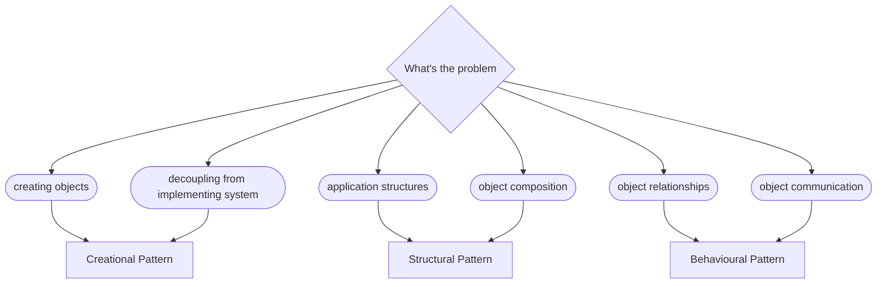
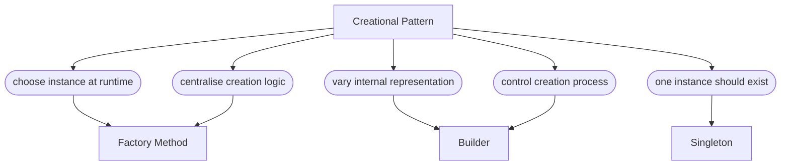
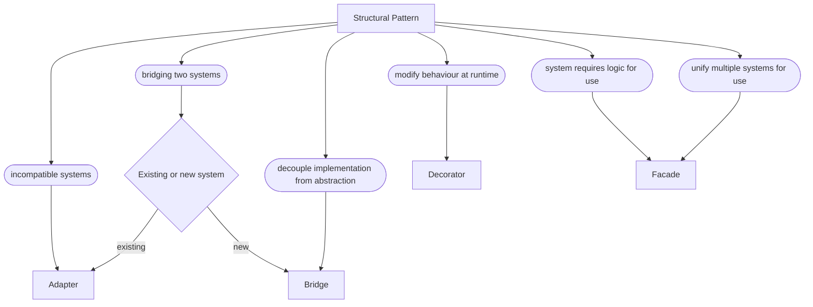
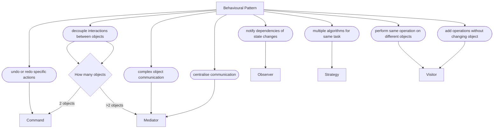

# noob - Design Pattern Decision Tree

## Choosing the right family of patterns

```mermaid
graph TD;
    start{What's the problem}
    
    start-->c1([creating objects])-->creational[Creational Pattern]
    start-->c2([decoupling from implementing system])-->creational

    start-->s1([application structures])-->structural[Structural Pattern]
    start-->s2([object composition])-->structural

    start-->b1([object relationships])-->behavioural[Behavioural Pattern]
    start-->b2([object communication])-->behavioural
```

## Choosing the right pattern

### Creational patterns

```mermaid
graph TD;
    creational[Creational Pattern]-->f1([choose instance at runtime])-->factory[Factory Method]
    creational-->f2([centralise creation logic])-->factory

    creational-->bu1([vary internal representation])-->builder[Builder]
    creational-->bu2([control creation process])-->builder

    creational-->si1([one instance should exist])-->singleton[Singleton]
```

### Structural patterns

```mermaid
graph TD;
    structural[Structural Pattern]-->a1([incompatible systems])-->adapter[Adapter]
    structural-->p1([bridging two systems])-->existingSystem{Existing or new system}-->|existing|adapter
    
    existingSystem-->|new|bridge[Bridge]
    structural-->b1([decouple implementation from abstraction])-->bridge
    
    structural-->d1([modify behaviour at runtime])-->decorator[Decorator]
    
    structural-->fa1([system requires logic for use])-->facade[Facade]
    structural-->fa2([unify multiple systems for use])-->facade
```

### Behavioural patterns

```mermaid
graph TD;
    behavioural[Behavioural Pattern]-->co1([undo or redo specific actions])-->command[Command]
    behavioural-->p1([decouple interactions between objects])-->howMany{How many objects}-->|2 objects|command
    
    p1-->howMany-->|>2 objects|mediator[Mediator]
    behavioural-->m1([complex object communication])-->mediator
    behavioural-->m2([centralise communication])-->mediator

    behavioural-->o1([notify dependencies of state changes])-->observer[Observer]

    behavioural-->st1([multiple algorithms for same task])-->strategy[Strategy]

    behavioural-->v1([perform same operation on different objects])-->visitor[Visitor]
    behavioural-->v2([add operations without changing object])-->visitor
```