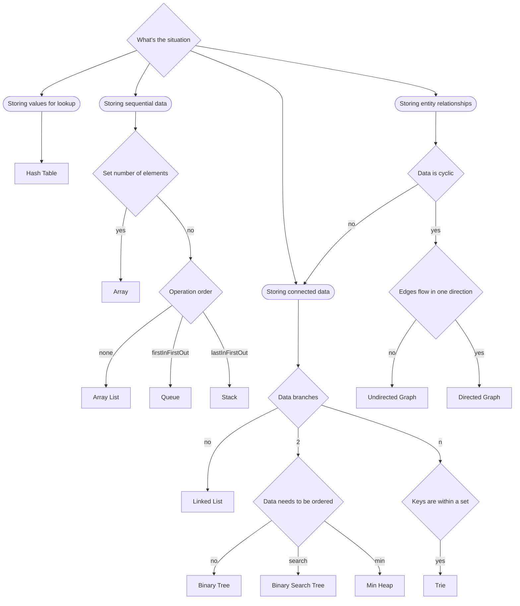

# noob - Data Structure Decision Tree

```mermaid
graph TD;
    start{What's the situation}

    start-->lookUp([Storing values for lookup])-->hashTable[Hash Table]

    %% SEQUENTIAL
    start-->sequential([Storing sequential data])-->setNumberOfElements{Set number of elements}-->|yes|array[Array]
    setNumberOfElements-->|no|operationOrder{Operation order}-->|none|arrayList[Array List]
    operationOrder-->|firstInFirstOut|queue[Queue]
    operationOrder-->|lastInFirstOut|stack[Stack]

    %% CONNECTED    
    start-->connected([Storing connected data])-->branches{Data branches}-->|no|linkedList[Linked List]

    branches-->|2|requiresOrder{Data needs to be ordered}-->|no|binaryTree[Binary Tree]
    requiresOrder-->|search|binarySearchTree[Binary Search Tree]
    requiresOrder-->|min|minHeap[Min Heap]

    branches-->|n|keysWithinSet{Keys are within a set}-->|yes|trie[Trie]

    %% CYCLIC
    start-->storingRelationships([Storing entity relationships])-->cyclic{Data is cyclic}-->|no|connected
    cyclic-->|yes|directedEdges{Edges flow in one direction}-->|no|undirectedGraph[Undirected Graph]
    directedEdges-->|yes|directedGraph[Directed Graph]
```